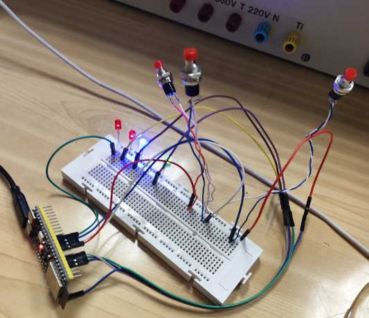
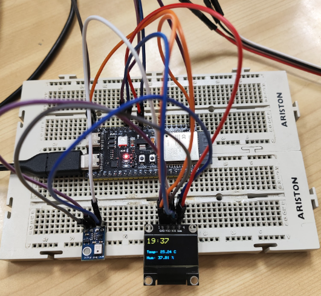
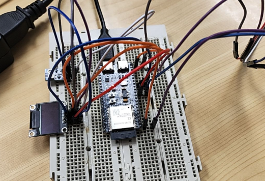

# Memòria de la Pràctica 4: SISTEMES OPERATIUS EN TEMPS REAL (FreeRTOS amb ESP32)
Treball realitzat per: Albert Calero i Alex Navarra Aquesta memoria correspon a la totalitat de la pràctica 4.


---


## Objectiu
L’objectiu de la pràctica és comprendre el funcionament d’un sistema operatiu en temps real (RTOS) utilitzant l’ESP32 mitjançant:
La creació de múltiples tasques
L’execució concurrent de processos
La gestió del temps de CPU
L’ús del planificador de FreeRTOS


## Introducció teòrica
Sistemes Operatius en Temps Real (RTOS)
Un RTOS (Real-Time Operating System) és un sistema operatiu dissenyat per executar tasques dins d’uns límits de temps determinats.
A diferència dels sistemes tradicionals:
No importa només què es calcula
També importa quan es calcula
Això és crític en sistemes embeguts com:
Control industrial
IoT
Automoció
Sistemes mèdics


Multitasca amb ESP32
L’ESP32 incorpora suport natiu per a FreeRTOS, permetent:
Execució de múltiples tasques en paral·lel
Assignació de prioritats
Execució en doble nucli
Cada tasca funciona com un "mini-programa" independent gestionat pel planificador.


Planificador (Scheduler)
El planificador és l’encarregat de:
Decidir quina tasca s’executa
Repartir el temps de CPU
Gestionar prioritats
Quan una tasca fa servir vTaskDelay(), cedeix la CPU perquè altres tasques puguin executar-se.


---


## Hardware







---


## Pràctica A: Execució de múltiples tasques
### Objeticu
Es crea una tasca addicional (anotherTask) amb FreeRTOS.
Aquesta tasca s’executa en paral·lel amb el loop() principal.
Ambdues tasques escriuen missatges pel port sèrie cada segon.
El planificador reparteix el temps de CPU entre elles.
### Software
```cpp


#include <Arduino.h>


void anotherTask( void * parameter );


void setup()
{
  Serial.begin(112500);
  /* we create a new task here */
  xTaskCreate(
    anotherTask, /* Task function. */
    "another Task", /* name of task. */
    10000, /* Stack size of task */
    NULL, /* parameter of the task */
    1, /* priority of the task */
    NULL); /* Task handle to keep track of created task */
}
  /* the forever loop() function is invoked by Arduino ESP32 loopTask */
void loop()
{
  Serial.println("this is ESP32 Task");
  delay(1000);
}
/* this function will be invoked when additionalTask was created */
void anotherTask( void * parameter )
{
  /* loop forever */
  for(;;)
  {
    Serial.println("this is another Task");
    delay(1000);
  }
  /* delete a task when finish,
  this will never happen because this is infinity loop */
  vTaskDelete( NULL );
}


```


Explicació del funcionament
El loop() és una tasca gestionada per FreeRTOS (loopTask).
anotherTask és una nova tasca creada manualment.
Ambdues tenen la mateixa prioritat (1), per tant:
El sistema reparteix el temps de CPU equitativament
Tot i que es fa servir delay(), el sistema continua alternant tasques
Si s’utilitzés vTaskDelay(), el control seria més precís


---


## Pràctica 2: Sincronització de tasques amb semàfors
### Objectiu
Crear dues tasques:
Una encén un LED
L’altra l’apaga
Però de forma sincronitzada, evitant conflictes


Concepte: Semàfor
Un semàfor és un mecanisme de sincronització que permet:
Controlar l’accés a recursos
Coordinar tasques


---
### Software


```cpp


#include <Arduino.h>


#define LED 2         //GPIO del led
#define T_HIGH 500    //Periodo encendido
#define T_LOW 200     //Periodo apagado


void taskEncender ( void * parameter );
void taskApagar ( void * parameter );


SemaphoreHandle_t semOn;
SemaphoreHandle_t semOff;


void setup()
{
  Serial.begin(115200);


  pinMode(LED, OUTPUT);


  semOn = xSemaphoreCreateBinary();
  semOff = xSemaphoreCreateBinary();
 
  //Definimos tareas
  xTaskCreate(
  taskEncender, /* Task function. */
  "Tarea de encendido del LED", /* name of task. */
  10000, /* Stack size of task */
  NULL, /* parameter of the task */
  1, /* priority of the task */
  NULL); /* Task handle to keep track of created task */


  xTaskCreate(
  taskApagar, /* Task function. */
  "Tarea de apagado del LED", /* name of task. */
  10000, /* Stack size of task */
  NULL, /* parameter of the task */
  1, /* priority of the task */
  NULL); /* Task handle to keep track of created task */


  xSemaphoreGive(semOn);
}


void loop ()
{


}


void taskEncender ( void * parameter )
{
  for(;;)
  {
    if(xSemaphoreTake(semOn, portMAX_DELAY))
    {
      digitalWrite(LED, HIGH);
      Serial.println("LED on.");
      vTaskDelay(T_HIGH / portTICK_PERIOD_MS);


      xSemaphoreGive(semOff); // Da paso a la otra tarea
    }
  }
}


void taskApagar ( void * parameter )
{
  for(;;)
  {
    if(xSemaphoreTake(semOff, portMAX_DELAY))
    {
      digitalWrite(LED, LOW);
      Serial.println("LED off.");
      vTaskDelay(T_LOW / portTICK_PERIOD_MS);


      xSemaphoreGive(semOn); // Da paso a la otra tarea
    }
  }
}


```


Es crea un semàfor binari
Només una tasca pot accedir al LED a la vegada
Les tasques s’alternen correctament:
LED ON
LED OFF
LED ON
LED OFF
...
Sense el semàfor, podrien solapar-se i provocar comportaments erronis


---


##  Pràctica Extra: Rellotge Digital amb ESP32 i FreeRTOS


### Objectiu


L’objectiu d’aquesta pràctica extra és aplicar els coneixements de FreeRTOS en ESP32 per implementar un sistema complet basat en:


Multitasca en temps real
Sincronització entre tasques
Comunicació entre processos
Gestió d’entrades (botons) i sortides (LEDs)
Implementació d’un rellotge digital funcional


### Introducció teòrica
#### Sistemes Operatius en Temps Real (RTOS)


Un sistema operatiu en temps real permet executar múltiples tasques de manera concurrent garantint que es compleixin restriccions temporals.


En aquest projecte s’utilitza FreeRTOS, integrat a l’ESP32, que permet:


Crear tasques independents
Assignar prioritats
Sincronitzar processos
Gestionar interrupcions


#### Conceptes clau utilitzats
 Multitasca


Execució simultània de diverses tasques gestionades pel scheduler.


Semàfors (Mutex)


Permeten protegir recursos compartits evitant errors de concurrència.


 Cues (Queues)


Permeten comunicar dades entre tasques o entre interrupcions i tasques.


Interrupcions (ISR)


Execució immediata davant d’un esdeveniment extern (pulsadors).


---


### Components utilitzats


ESP32
2 LEDs (amb resistències)
2 pulsadors
Protoboard
Cables de connexió


---


### Estructura del sistema


El sistema està compost per 4 tasques principals:


Tasca   Funció
TareaReloj  Actualitza el temps cada segon
TareaLecturaBotones Gestiona les entrades dels botons
TareaActualizacionDisplay   Mostra la hora pel port sèrie
TareaControlLEDs    Controla l’estat dels LEDs


---


## Software


```cpp


#include <Arduino.h>


#define LED_G 21    //GPIO del led verde
#define LED_R 2     //GPIO del led rojo
#define T_G 1000    //Periodo del led verde
#define T_R 300     //Periodo del led rojo


void Blink (uint8_t GPIO, uint32_t T);


void taskLED_G( void * parameter );
void taskLED_R( void * parameter );


void setup()
{
  Serial.begin(115200);


  //Definimos tareas
  xTaskCreate(
  taskLED_G, /* Task function. */
  "Tarea de parpadeo del led verde", /* name of task. */
  10000, /* Stack size of task */
  NULL, /* parameter of the task */
  1, /* priority of the task */
  NULL); /* Task handle to keep track of created task */


  xTaskCreate(
  taskLED_R, /* Task function. */
  "Tarea de parpadeo del led rojo", /* name of task. */
  10000, /* Stack size of task */
  NULL, /* parameter of the task */
  1, /* priority of the task */
  NULL); /* Task handle to keep track of created task */
}


void loop ()
{


}


void Blink(uint8_t GPIO, uint32_t T)
{
  pinMode(GPIO, OUTPUT);


  while(true)
  {
    digitalWrite(GPIO, HIGH);
    vTaskDelay(T/2);
    digitalWrite(GPIO, LOW);
    vTaskDelay(T/2);
  }
}


void taskLED_G( void * parameter )
{
  Blink(LED_G, T_G);
}


void taskLED_R( void * parameter )
{
  Blink(LED_R, T_R);
}


```


---


## Resultats
Execució concurrent correcta de tasques


Sincronització efectiva amb semàfors


Control precís del LED


## Conclusions
Aquesta pràctica permet entendre com un sistema operatiu en temps real gestiona múltiples tasques dins d’un microcontrolador.
S’ha comprovat que:
FreeRTOS permet paral·lelisme real
El planificador reparteix el temps de CPU eficientment
Les prioritats influeixen en l’execució
Els semàfors són essencials per evitar conflictes


## Conclusió final
La combinació de:
Multitasca
Sincronització
Control de prioritats
converteix l’ESP32 en una plataforma molt potent per a sistemes IoT avançats.
Aquesta pràctica estableix les bases per desenvolupar aplicacions més complexes com:
Sistemes distribuïts
Control en temps real
Automatització intel·ligent


